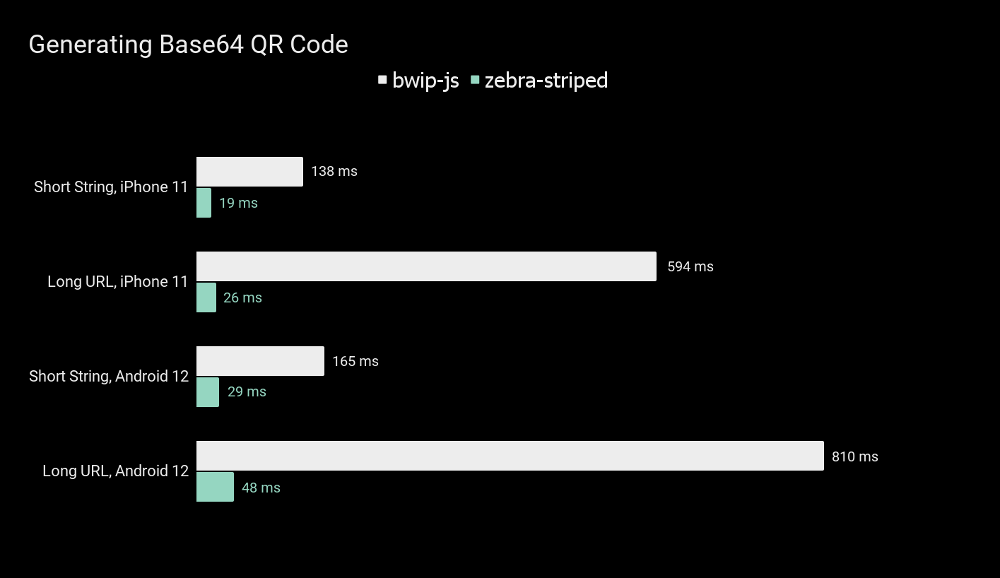

# zebra-striped 🦓

Generate barcodes natively in React Native with the ZXing library underhood!

## The story behind

When I was working on generating QR codes in one of the apps for a client, I realized that JS-based libraries like [BWIP JS](https://www.npmjs.com/package/bwip-js) are not very performant in React Native apps, where performance is especially important for keeping users happy.

I decided to experiment a little and learn about Expo Native Modules, Swift, and Kotlin. This led to the creation of **zebra-striped** - a performant, native-based library for generating various types of barcodes for React Native.

Feedback is highly appreciated!

## Supported code formats

| 1D Codes | 2D Codes    |
| -------- | ----------- |
| Code 128 | QR          |
| Code 39  | PDF417      |
| Code 93  | Aztec       |
| Codabar  | Data Matrix |
| EAN-13   |             |
| EAN-8    |             |
| ITF      |             |
| UPC-E    |             |
| UPC-A    |             |

## Performance 🏎️



## Usage

Here's a basic usage of **ZebraCode** component:

```js
<ZebraCode
  value={"I'm very striped!"}
  format="qr"
  size={{ width: 300, height: 300 }}
/>
```

Want a custom colors? 🎨 I've got you covered:

```js
<ZebraCode
  value={"I'm very striped!"}
  format="qr"
  size={{ width: 300, height: 300 }}
  onColor="#141414"
  offColor="#ffffff"
/>
```

(Colors are accepted only in HEX)

Or maybe you just want to have a data returned in Base64 format? Here's how you can do it:

```js
const base64Image = getBase64Code("I'm base64'ed!", "qr", {
  width: 300,
  height: 300,
});
```

```js
const base64Image = getBase64Code("I'm custom-colored!", "qr", {
    width: 300,
    height: 300
}, "#141414", #ffffff);
```

## Installation

#### Add the package to your npm dependencies

```
npm install zebra-striped
```

### Expo 🚀

After installation you'll need to rebuild your dev client. Zebra 🦓 will not work in Expo Go!

### Plain React Native 📚

For plain React Native project you must install and configure `expo` package, follow the ["Install Expo modules in an existing React Native project"](https://docs.expo.dev/bare/installing-expo-modules/) article.

#### iOS 📱

Make sure to run `pod install` in `ios` folder.

## Contributing

Contributions are very welcome, I'm open for any suggestions!
